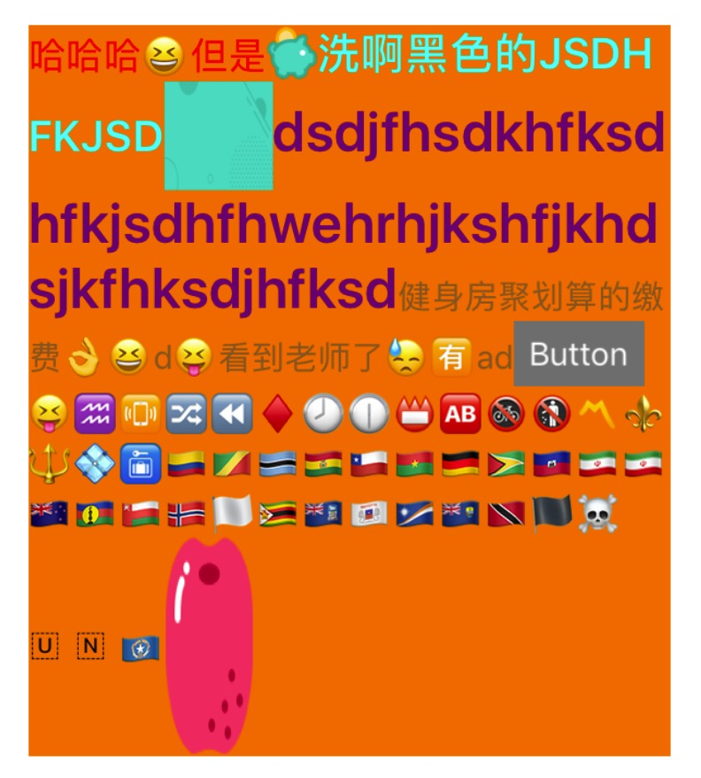
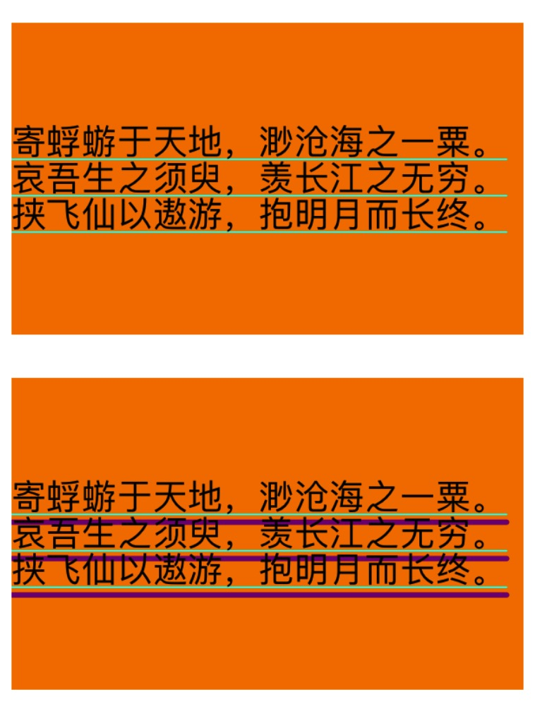
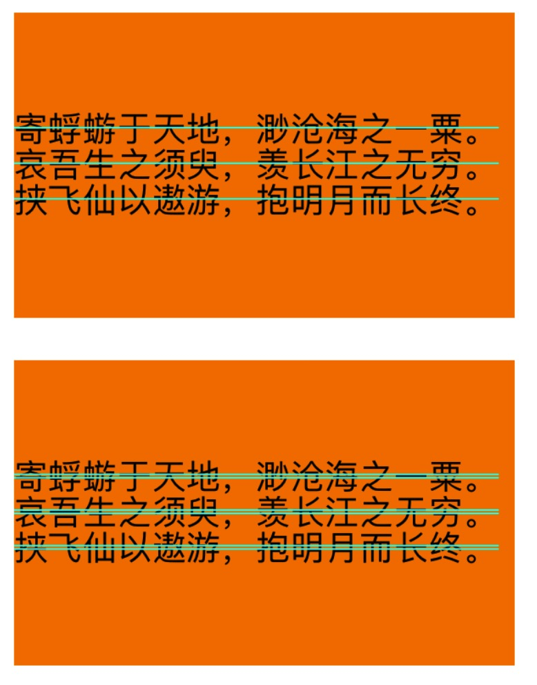
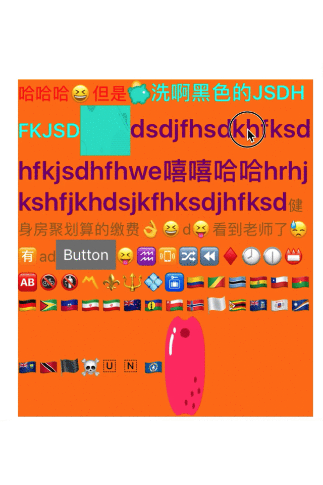

# SwiftyText
基于`CoreText`，用`Swift`实现的轻量级自定义Label，代码整体思路类似于`YYText`，但是做了很多优化，加入很多自己的理解，在`YYText`的基础上，解决了许多`issues`中未解决的问题。

# 👉该框架不支持OC，只支持Swift👈

# 背景
在开发中，使用到富文本在所难免，大家用的最多的可能就是`YYText`了，但是`YYtext`已经有3年没更新了，而iOS系统却一直在更新，一个再好的三方库，如果不一直维护，也会随着系统的不断升级出现各种bug。在我使用`YYText`的过程中，就出现了各种问题，比如高度计算不准确、文本垂直居中有问题等等。也正是因为这些原因，促使我写了这个库，同时仔细阅读`YYText`源码，并翻阅其他各种富文本三方库，写一个属于自己的富文本框架。

在编写该框架过程中，借鉴了许多三方库:
- [YYtext](https://github.com/ibireme/YYText)(主要)
- [BSText](https://github.com/a1049145827/BSText)(Swift版本的YYText)
- [TYAttributedLabel](https://github.com/12207480/TYAttributedLabel)
- [TYText](https://github.com/12207480/TYText)
- [DTCoreText](https://github.com/Cocoanetics/DTCoreText)
- [M80AttributedLabel](https://github.com/xiangwangfeng/M80AttributedLabel)

# 特性
- ✅ `SwiftLabel`的API和系统原生`UILabel`一样，并且增加了一些新特性
- ✅ 支持异步与同步渲染，默认开启了异步渲染
- ✅ 图文混排支持`UIImage`、`UIView`、`CALayer`
- ✅ 支持自定义高亮，并设置`userInfo`，点击时，可获取到该`userInfo`
- ❌ 不支持垂直排版

# 效果
属性 | Demo
:-: | :-: 
图文混排 | 
下划线(SwiftyTextUnderLine) | 
删除线(SwiftyTextStrikethrough)| 
高亮 | 

更多效果请运行Demo

# 针对`YYText`中目前未被Close的问题，本人接下来会一一进行解答
- [YYTextAsyncLayer类中对contentsScale的设置是有问题的...](https://github.com/ibireme/YYText/issues/920)

该问题，本人对源码进行了仔细阅读，发现在`YYTextAsyncLayer`和`YYLabel`中中，都同时设置了`contentsScale`，因此不会出现该问题

- [使用特殊文本时，YYLabel会有一长串的空格](https://github.com/ibireme/YYText/issues/915)

待解决

- [可以进行iOS13黑暗模式适配吗](https://github.com/ibireme/YYText/issues/911)

之后的更新会加上，前期该功能先暂时忽略

- [文字带下划线，可以调整下划线与文字的间距吗？](https://github.com/ibireme/YYText/issues/908)

待解决

- [YYLabel设置NSLineBreakByTruncatingHead、NSLineBreakByTruncatingMiddle、YYTextTruncationTypeStart、YYTextTruncationTypeMiddle和UILabel显示效果不一样](https://github.com/ibireme/YYText/issues/907)

已解决。在`CTLineTruncationType`为`start`和`middle`的情况下，需要单独设置下`lastLineAttributedText`。
原问题有人已经给出了解决办法，但是有限制，本人进行了优化。

- [YYTextAsyncLayer非主线程刷新](https://github.com/ibireme/YYText/issues/904)

该问题本人猜测是由于`displaysAsynchronously`设置为`true`，但是却在非主线程操作UI导致的，本人在`displaysAsynchronously`为`true`时，加入了
```
dispatch_async(dispatch_get_main_queue(), ^{

});
```

- [YYLabel 动画过程中不响应 highlightTapAction](https://github.com/ibireme/YYText/issues/901)

待解决

- [YYTextLayout计算的高度不准确](https://github.com/ibireme/YYText/issues/900)

在写框架Demo的过程中，本人终于复现了该问题。<br>

当`label`的`lineBreakMode`设置为`byCharWrapping`，然后用`YYTextLayout`的`layoutWithContainerSize:text:`计算高度，就有可能会出现高度计算不准确的问题。<br>

仔细阅读`YYLabel`源码，发现在对`label`设置`lineBreakMode`时，内部会对`lineBreakMode`进行纠正，也就是说最终的`lineBreakMode`有可能不是你最初传入的值，而`YYTextLayout`的`layoutWithContainerSize:text:`默认使用的`lineBreakMode`为`byTruncatingTail`。`byCharWrapping`和`byTruncatingTail`在中英文混排时，表现形式是不一样的，这也就是`YYTextLayout`计算高度不准确的原因。<br>

本框架已解决该问题，但是需要特别的设置
```
let lineBreakMode: NSLineBreakMode = .byCharWrapping // 定义一个常量，存储`lineBreakMode`、
self.label.lineBreakMode = lineBreakMode // `label`设置`lineBreakMode`
let container = SwiftyTextContainer()
container.size = CGSize(width: frame.width, height: CGFloat.greatestFiniteMagnitude)
container.lineBreakMode = lineBreakMode // `container`设置`lineBreakMode`
let layout = SwiftyTextLayout.layout(container: container, attributedText: sumAtr)
```
